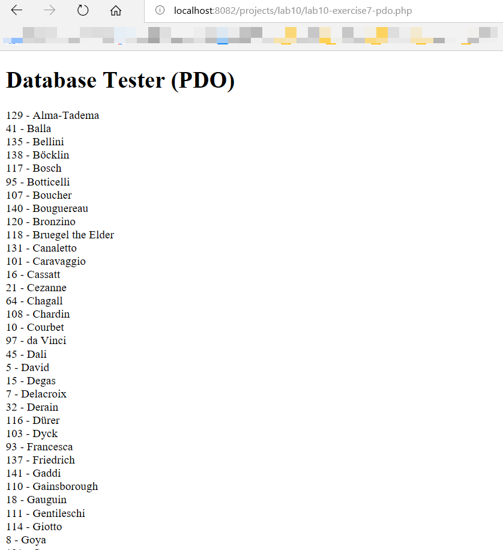
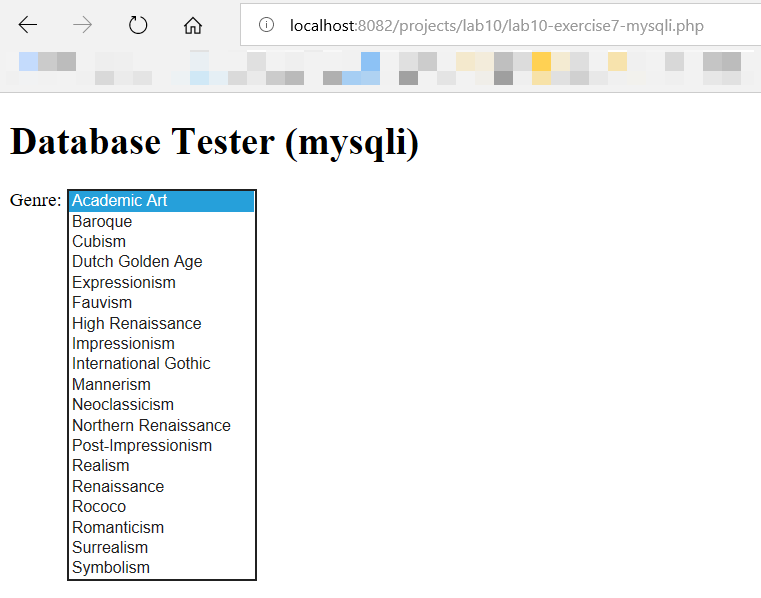
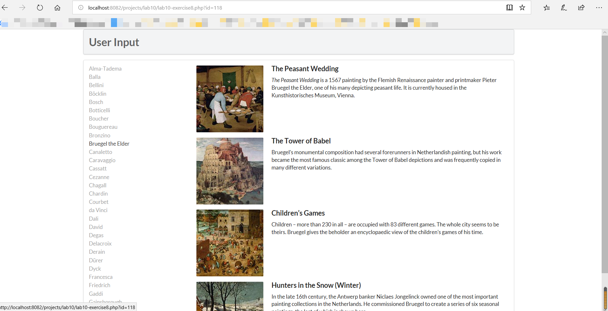
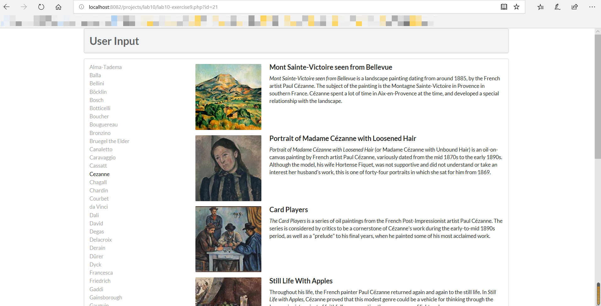
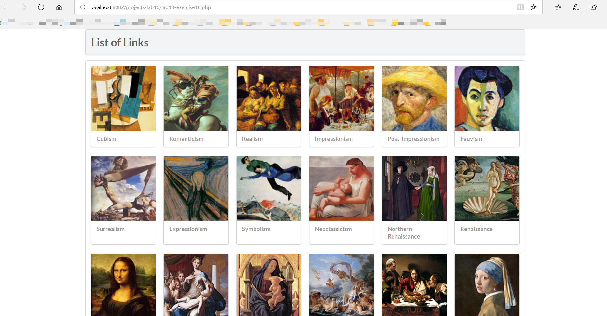

# Lab10
学号：17307130333  
姓名：贺曦
## Exercise7: MYSQL THROUGH PHP  

2. Open `lab10-exercise7-pdo.php` and modify as follows:  

   ```php
   <?php require_once('config.php'); ?>//引入配置文件
   <!DOCTYPE html>
   <html>
   <body>
   <h1>Database Tester (PDO)</h1> <?php
   try {
     $pdo = new PDO(DBCONNSTRING,DBUSER,DBPASS); // 根据配置信息初始化一个PDO对象
     $pdo->setAttribute(PDO::ATTR_ERRMODE, PDO::ERRMODE_EXCEPTION);  //设置属性:错误报告、抛出 exceptions 异常
     $sql = "select * from Artists order by LastName";//设置sql查询语句，查询Artists表中的所有信息，并按照LastName进行排序
     $result = $pdo->query($sql);//执行操作，并获得sql查询结果
     while ($row = $result->fetch()) {//循环，取出每一个结果条目，直到终止
         echo $row['ArtistID'] . " - " . $row['LastName'] . "<br/>"; //输出到界面（该条目的艺术家的ID - 该条目的LastName（换行））
     }
     $pdo = null; //不再引用，释放内存
   }catch (PDOException $e) { 
       die( $e->getMessage() );
   }
   ?>  
   </body>  
   </html>
   ```
3. Save and test.**Please take screenshots of the result!**  
 
根据配置创建PDO类的实例，进行mysql查询，获得所有艺术家的信息（按顺序排列），然后显示，若出错则die。（详细说明见注释）

4. Open `lab10-exercise7-mysqli.php` and modify as follows:  
   ```php
   <?php require_once('config.php'); ?>//引入配置文件
   <!DOCTYPE html>
   <html>
   <body>
   <h1>Database Tester (mysqli)</h1> Genre:
   <select>//选择器
   <?php  
   $connection = mysqli_connect(DBHOST, DBUSER, DBPASS, DBNAME); //根据配置信息，建立数据库连接
   if ( mysqli_connect_errno() ) {//判断是否出错
      die( mysqli_connect_error() ); 
   }
   $sql = "select * from Genres order by GenreName";//设置sql查询语句 ，在Genres表钟查询所有条目，并按照GenreName的顺序排列
   if ($result = mysqli_query($connection, $sql)) {//执行查询，并获得结果集
     // loop through the data
     while($row = mysqli_fetch_assoc($result)) {//循环遍历每个条目，直到终止
        echo '<option value="' . $row['GenreID'] . '">'; //输出到界面（新增选项：value=当前条目的GenreID）
        echo $row['GenreName'];//（显示的字段=当前条目的GenreName）
        echo "</option>";//选项终止
     }
     // release the memory used by the result set
     mysqli_free_result($result); //释放结果集内存
   }
   // close the database connection
   mysqli_close($connection);//关闭数据库连接
   ?>
   </select>
   </body>
   </html>
   ```
5. Save and test. **Please take screenshots of the result!**  
  
根据配置创建mysql，进行mysql查询，获得所有体裁类别的信息（按顺序排列），然后挨个设置成下拉框的选项（详细说明见注释）


## Exercise8: INTEGRATING USER INPUTS (PDO)  
1. outputArtists()：  
```php
/*
在页面的侧边显示艺术家的链接list
*/
function outputArtists() {
   try {
         $pdo = new PDO(DBCONNSTRING,DBUSER,DBPASS);//根据配置文件创建PDO类的实例
         $pdo->setAttribute(PDO::ATTR_ERRMODE, PDO::ERRMODE_EXCEPTION);//设置属性：错误及异常抛出
       //设置sql语句，在Artists表钟查询从0行开始的30条数据，将结果按照LastName排序
         $sql = "select * from Artists order by LastName limit 0,30";
         $result = $pdo->query($sql);//执行查询，并且获得结果集
         while ($row = $result->fetch()) {//遍历条目
             //输出到html，创建链接  "当前脚本的路径?id=艺术家ID"
            echo '<a href="' . $_SERVER["SCRIPT_NAME"] . '?id=' . $row['ArtistID'] . '" class="';
            //如果这个id已经点击过了则把class +活跃状态
            if (isset($_GET['id']) && $_GET['id'] == $row['ArtistID']) echo 'active ';
            echo 'item">';//类 +item
            echo $row['LastName'] . '</a>';//显示文本是LastName
         }
         $pdo = null;//释放内存
   }
   catch (PDOException $e) {//异常处理
      die( $e->getMessage() );
   }
}
```  
2. outputPaintings()：
```php
/*
 根据特定艺术家的ID（点击的id）显示画作的list
*/
function outputPaintings() {
    try {
        if (isset($_GET['id']) && $_GET['id'] > 0) {//判断设置过id(点击链接跳转时)
            $pdo = new PDO(DBCONNSTRING,DBUSER,DBPASS);//new PDO类
            $pdo->setAttribute(PDO::ATTR_ERRMODE, PDO::ERRMODE_EXCEPTION);//设置错误...
            //设置sql语句，在Paintings表中，根据ArtistId(当==特定艺术家id时)查询所有信息
            $sql = 'select * from Paintings where ArtistId=' . $_GET['id'];
            $result = $pdo->query($sql);//获得结果集
            while ($row = $result->fetch()) {//遍历条目
                outputSinglePainting($row);//单个输出画作
            }
            $pdo = null;//释放内存
        }
    }catch (PDOException $e) {//异常处理
        die( $e->getMessage() );
    }
}

```  
3. outputPaintings()：
```php
/*
 显示单个画作
*/
function outputSinglePainting($row) {
    //输出html
    echo '<div class="item">';
    echo '<div class="image">';
    //设置图片的路径（通过条目的ImageFileName）
    echo '';
    echo '</div>';
    echo '<div class="content">';
    echo '<h4 class="header">';
    //设置图片的标题（通过条目的Title）
    echo $row['Title'];
    echo '</h4>';
    echo '<p class="description">';
    //设置图片的介绍（通过条目的Excerpt）
    echo $row['Excerpt'];
    echo '</p>';
    echo '</div>'; // end class=content
    echo '</div>'; // end class=item

}
```   
  


## Exercise9: PREPARED STATEMENTS  

```php
function outputPaintings() {
    try {
        if(isset($_GET['id']) && $_GET['id'] > 0) {
            $pdo = new PDO(DBCONNSTRING,DBUSER,DBPASS);
            $pdo->setAttribute(PDO::ATTR_ERRMODE, PDO::ERRMODE_EXCEPTION);

            //设置sql语句，并且:id为变量占位符
            $sql = 'select * from Paintings where ArtistId=:id';
            $id = $_GET['id'];

            //设置预处理语句，并且将id绑定到之前的:id占位符中，再执行查询命令
            $statement = $pdo->prepare($sql);
            $statement->bindValue(':id', $id);
            $statement->execute();

            //处理结果集
            while ($row = $statement->fetch()) {
                outputSinglePainting($row);
            }
            $pdo = null;
        }
    }catch(PDOException $e) {
        die( $e->getMessage() );
    }

}
```  
    
使用PREPARED STATEMENTS的好处是：规避了由于字符串拼接导致的sql注入风险。


## [Optional] Exercise10: HTML LIST AND RESULTS  
1. outputGenres()：
```php
function outputGenres() {
    try {
        //创建PDO实例
        $pdo = new PDO(DBCONNSTRING,DBUSER,DBPASS);
        $pdo->setAttribute(PDO::ATTR_ERRMODE, PDO::ERRMODE_EXCEPTION);

        //设置sql语句，从Genres表中查询条目（结果集仅包含GenreId，GenreName, Description属性）并根据GenreID排序
        $sql = 'select GenreId, GenreName, Description from Genres Order By GenreID';
        $result = $pdo->query($sql);

        //遍历结果集
        while ($row = $result->fetch()) {
            outputSingleGenre($row);//单个条目输出
        }
        $pdo = null;
    }catch (PDOException $e) {//异常处理
        die( $e->getMessage() );
    }

}
   ```  
2. outputSingleGenre($row)：
   ```php
   function outputSingleGenre($row) {
       //设置html
       echo '<div class="ui fluid card">';
       echo '<div class="ui fluid image">';
       //设置img图片地址
       $img = '';
       //输出包装点击该图片的链接<a>
       echo constructGenreLink($row['GenreId'], $img);
       echo '</div>';
       echo '<div class="extra">';
       echo '<h4>';
       //输出包装点击该图片类别名的链接<a>
       echo constructGenreLink($row['GenreId'], $row['GenreName']);
       echo '</h4>';
       echo '</div>'; // end class=extra
       echo '</div>'; // end class=card

   }
   ```   
3. constructGenreLink($id, $label)
   ```php
   function constructGenreLink($id, $label) {
       //设置链接url，将id值放到其中
       $link = '<a href="genre.php?id=' . $id . '">';
       //将内容包入<a></a>中
       $link .= $label;
       $link .= '</a>';
       return $link;

   }
   ```  

     


   


