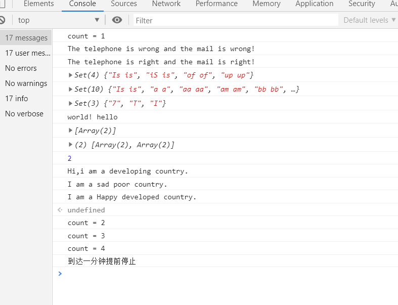
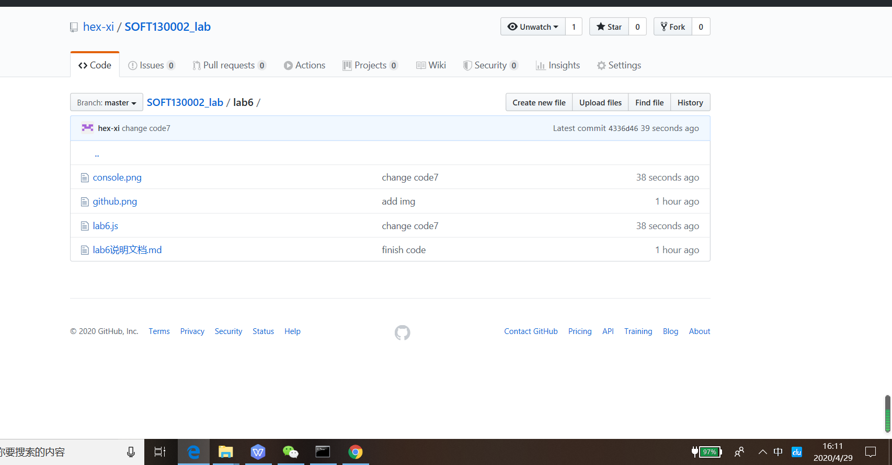

# Lab6设计文档

学号：17307130333  
姓名：贺曦  

## 1 各个正则表达式的解释

###1.1 T2
	①电话11位数字 phoneRe = /\d{11}/;  
	\d：
		任一0~9数字  
	{11}：
		前面的（\d） 出现且仅出现11次  
	  
    ②邮箱格式 mailRe = /^[\w_-]+@(163.com|qq.com|126.com)$/;  
	（要求：只允许英文字母、数字、下划线、以及中划线组成,结尾是qq.com或163.com或126.com）  
	^：  
		表示开头  
	[\w_-]：  
		表示任一属于字母数字下划线中划线的字符  
	+：  
		表示前者（[\w_-]）出现1~任意次  
	@:   
		表示必须出现@字符  
	(163.com|qq.com|126.com)：  
		一个分组并选择，必须出现qq.com或163.com或126.com其中一个  
	$：  
		表示结尾
	
###1.2 T3
	相邻重复单词 baseRe = /([a-z]+) \1/gi ;
	（[a-z]+）:
		表示1~∞个小写字母组成 的第一个分组
	空格：
		表示这个位置有个空格
	\1：
		重复第一个分组
	/gi：
		g表示该表达式是global的，可以多次继续调用。i表示无视字母大小写
	
## 2 继承不同方式的理解
借助构造函数：借用父类的构造函数，给子类属性初始化，完成继承  
原型链：将父类的实例作为子类的原型，由于查找属性或方法时会沿着原型链查找，所以完成了继承的效果。  
Object.create：帮助我们创建一个新对象,使用父类作为提供新创建的对象的原型，规范了原型继承  

## 3 Map、Set、Array之间的区别和使用。
Map是键值对的集合，同名key会覆盖，便于搜索查找。
Set是单值集合，相同的值只保留一个，便于筛选。
Array是普通的集合，可保留相同的值，基础万能存储数据为主。

## 4 截图

